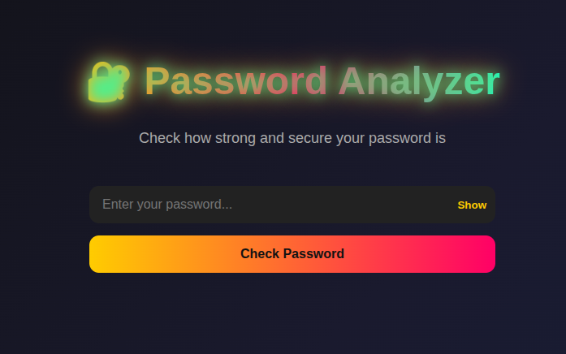
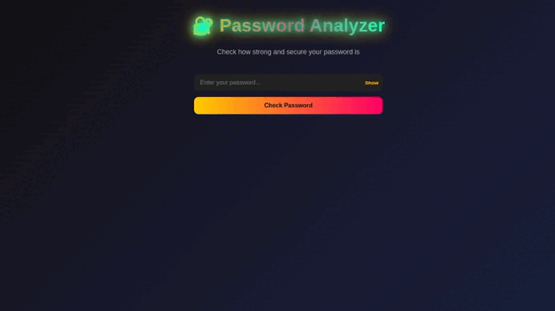

# 🔐 Password Analyzer

**Password Analyzer** is a **React + FastAPI** web application that checks password strength in real time.  
It analyzes password length, entropy, strength, and checks if the password has been compromised in known data leaks.

---

## 🚀 Features

- Enter a password and get instant feedback.
- Visual **progress bar** (weak / medium / strong).
- Check if the password exists in data breach databases.
- Shows **safety percentage** for each password.
- Modern interface with animations and toggles to show/hide password.

---

## 🖼️ Screenshots

### Main UI


### Checking password


---

## 🐳 Docker Compose (Frontend + Backend)

### Run both services
```bash
docker-compose up --build
```
